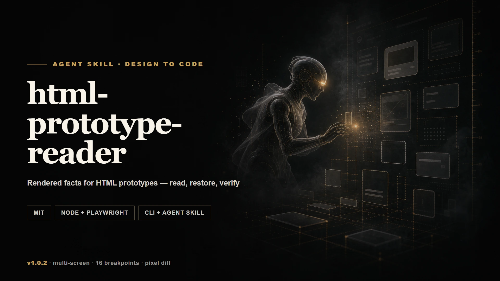
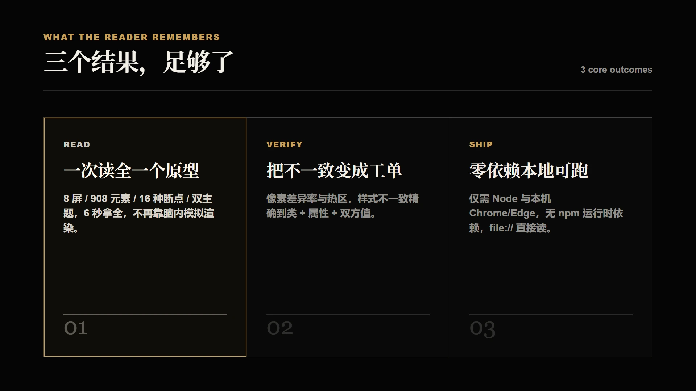

<div align="center">

# html-prototype-reader

**Rendered facts for HTML prototypes — read, restore, verify**



[](LICENSE)


[简体中文](README.zh-CN.md) · [CLI reference](docs/cli-reference.md) · [Output schema](docs/output-schema.md)

</div>

---

## What it is

An agent skill plus two CLI tools. `capture.js` renders an exported HTML prototype in a real browser and reads it the way a browser does — every screen, every computed style, every interaction — then writes a component tree an agent can restore code from. `diff.js` closes the loop: it compares the restoration against the prototype pixel by pixel and returns a list of concrete discrepancies.

It exists because an agent that reads HTML source is reading a description of a page, not the page.

## Why it is needed

- **Computed styles are not in the source.** Cascade, inheritance, browser defaults and resolved `var()` values only exist after rendering. In one measured prototype: 1,201 `var()` references across 37 custom properties.
- **Layout geometry is not in the source.** Absolute coordinates, real flex/grid arrangement, actual element sizes.
- **Dynamic prototypes are unreadable at source level.** In one measured 783 KB prototype, static HTML was 1 KB and 650 KB was JavaScript; all screens were assembled at runtime via `innerHTML`, and 6 of 7 screens were invisible on load.
- **Parsers cannot substitute.** jsdom has no layout engine (`getBoundingClientRect` always 0) and no pseudo-element computed styles.

## You get



A structured `prototype.json` (component tree, style diffs, interactions with live widget state — checkboxes, radios, select options, search/textarea values, open dialogs and off-canvas drawers — breakpoints, theme states, overlays, iframe subtrees), a `summary.md` for the agent to read first, a screenshot per screen, and — after restoration — a `diff-report.md` with a pixel-difference ratio, labelled hotspots and a style-mismatch list. AI-generated prototypes often keep several versions alive at once; capture reports that too: dormant and never-seen CSS selectors, hidden branches, duplicate ids and version-residue class names, so the restoration targets the reachable version only.

## How it works

`capture.js` runs four steps: render and extract (full DOM walk + `getBoundingClientRect` + computed-style whitelist, diffed against each parent so only non-inherited differences are kept), traverse (discover nav/tab entries, click each, dedupe screens by visible-element signature), compress (fold repeated sibling subtrees, round values) and output. Screenshots are taken with animations frozen, so the baseline is reproducible. `diff.js` re-renders both sides at the same viewport, freezes both, and compares inside the browser canvas — no image library, no local PNG decoding.

## Quick start

```bash
npm i                                     # playwright-core only (optional peer dependency)

node scripts/capture.js "C:/proto/dashboard.html" "C:/out/prototype"
node scripts/diff.js "C:/proto/dashboard.html" "http://localhost:5173" "C:/out/acceptance"
```

Read `C:/out/prototype/summary.md` first: screens, breakpoints, theme states, overlays and broken references on one page. `capture.js` accepts a directory to process a multi-page prototype, and the diff accepts a local file or a running dev-server URL on either side.

## Installation

```bash
npx skills add clarklee186/html-prototype-reader           # as an agent skill
# or
git clone https://github.com/clarklee186/html-prototype-reader.git && cd html-prototype-reader && npm i
```

Requirements: Node ≥ 18, `playwright-core` ≥ 1.40, and a local Chrome or Edge (only if neither exists does it download a bundled Chromium). `playwright-core` is resolved from `NODE_PATH`, then `~/.workbuddy/binaries/node/workspace/node_modules`, then a sibling `node_modules`.

## CLI

```bash
node scripts/capture.js <html-file-or-dir> <output-dir> [--viewport 1440x900] [--max-screens 30] [--timeout 45000]
node scripts/diff.js    <prototype|URL>  <restored|URL>  <output-dir> [--viewport 1440x900] [--threshold 32] [--block 100]
```

Full option tables, interpretation thresholds and scenario advice: [docs/cli-reference.md](docs/cli-reference.md). Output files and the `prototype.json` field reference: [docs/output-schema.md](docs/output-schema.md).

## Limits

Deep interactions (modal contents, nested tabs, inline expansion) only exist after being triggered. Canvas bitmaps are not extracted, and cross-origin iframes record `src` only (same-origin frames are recursed to depth 2). Screen dedup is signature-based, so near-identical screens can merge — bounded by `--max-screens`.

## Proof

On a 783 KB multi-screen dashboard prototype (JS-assembled, dual theme, 45 `@media` blocks): capture returned 8 screens, 908 visible elements, 16 distinct breakpoints and the dual-theme probe in 6–7 s; a self-diff scored ratio 0; an injected colour/radius mutation was reported as 4 style mismatches localised to class + property + value.

## License

[MIT](LICENSE)

## About the author

Built and maintained by [Clark Lee (@clarklee186)](https://github.com/clarklee186). Issues and pull requests are welcome — [AGENTS.md](AGENTS.md) documents the invariants to keep in mind before changing anything.
